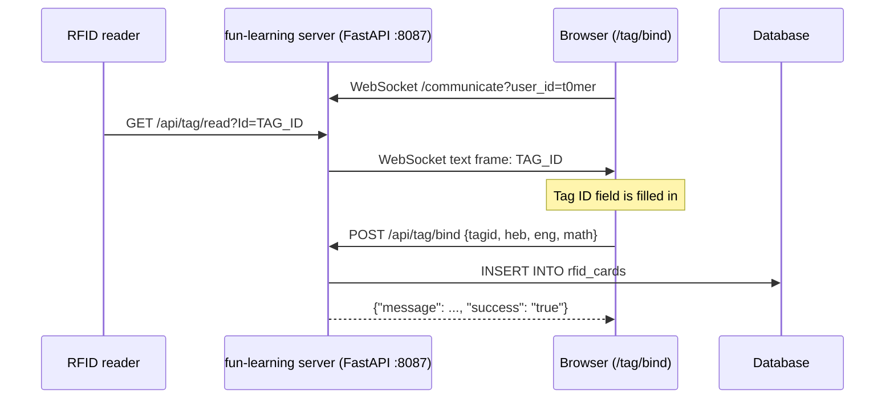

# fun-learning

A small FastAPI server that binds **RFID tags** (cards) to learning items: a Hebrew letter, an
English letter and a number. An RFID reader reports the ID of a scanned tag to the server, the
server pushes that ID to a browser over a WebSocket, and a web form lets you choose which letter
and number the card stands for. The bindings are stored in a database so a game or learning
activity can look them up later.

> **Status: early prototype / work in progress.** The repository contains only the tag-binding
> ("teach") side of the project. There is no game or quiz UI, no reader firmware, no
> `requirements.txt`, no Dockerfile and no tests. The code as committed does not start because
> of a missing module import, and binding a card has further problems (see
> [Known issues](#known-issues)).

## Table of contents

- [Features](#features)
- [How it works](#how-it-works)
- [Requirements](#requirements)
- [Installation and running](#installation-and-running)
- [Configuration](#configuration)
- [Data model](#data-model)
- [API reference](#api-reference)
- [Usage](#usage)
- [Security notes](#security-notes)
- [Known issues](#known-issues)
- [Project layout](#project-layout)
- [Contributing](#contributing)
- [License](#license)

## Features

- **Bind page** (`GET /tag/bind`): a Bootstrap form with a read-only *Tag ID* field and three
  drop-downs (Hebrew letter, English letter, number). The *Bind* button saves the card.
- **Live tag push**: when a reader calls `GET /api/tag/read?Id=<tag>`, the server stores the ID
  and sends it over the `/communicate` WebSocket, so the bind page fills in the Tag ID field
  without polling.
- **Polling fallback**: `GET /api/tag/scan` returns the last reported tag ID. The page's
  polling loop that used it is now commented out.
- **Card storage**: `POST /api/tag/bind` saves a card. Duplicate tag IDs are rejected.
- **Lookup endpoints**: list card types, the items of a card type (letters or numbers) and all
  bound cards.
- **Prometheus metrics** at `/metrics` (via `starlette_exporter`).
- **Interactive API docs**: FastAPI's defaults, `/docs` (Swagger UI) and `/redoc`.
- **Seed data**: SQL scripts with the 22 Hebrew letters (א–ת), the 26 English letters (A–Z) and
  the numbers 0–10.

## How it works



- The last reported tag ID is kept in a single global variable (`tag_id`) in memory. It is
  cleared after each bind attempt and by `GET /api/tag/clear`.
- `/api/tag/read` sends the ID only to the WebSocket client registered as `user_id=t0mer`.
  The bind page connects with that user ID.
- The reader hardware and its firmware are not part of this repository. Any device or script
  that can send an HTTP GET request with the tag ID can act as the reader.
  <!-- TODO: verify which reader device/firmware is used -->

## Requirements

- Python 3. The version is not pinned anywhere in the repository.
  <!-- TODO: verify supported Python version -->
- A **MySQL** server. The active connector (`app/sqliteconnector.py`) uses SQLAlchemy with
  PyMySQL (`mysql+pymysql://…@localhost/tags`), despite the class name `SqliteConnector`.
  The committed SQLite file `app/db/tags.db` is only used by the older, unused
  `app/sqliteconnector copy.py`.
- Python packages, taken from the imports (there is no `requirements.txt`, so no versions are
  pinned):

  | Package | Used for |
  |---|---|
  | `fastapi` | Web framework, WebSocket endpoint |
  | `uvicorn` | ASGI server |
  | `jinja2` | HTML template rendering (`Jinja2Templates`) |
  | `loguru` | Logging |
  | `starlette-exporter` | Prometheus middleware and `/metrics` |
  | `sqlalchemy` | Database access |
  | `pymysql` | MySQL driver |
  | `requests` | Imported by `app.py` (not used) |

- A browser for the bind page. The page loads Bootstrap 4, jQuery 3.2.1, Font Awesome and
  SweetAlert2 from public CDNs, so the browser needs internet access.
- An RFID reader that reports tag IDs over HTTP (see [How it works](#how-it-works)).

## Installation and running

There is no packaged release or container image. To run from source:

```bash
git clone https://github.com/t0mer/fun-learning.git
cd fun-learning
python3 -m venv .venv
. .venv/bin/activate
pip install fastapi uvicorn jinja2 loguru starlette-exporter "sqlalchemy<2" pymysql requests
```

`sqlalchemy<2` is suggested because `add_new_card` never calls `commit()`. With SQLAlchemy 2.x
the insert is rolled back when the connection closes, so cards are reported as added but never
saved (see [Known issues](#known-issues)). With 1.x, `text()` INSERTs are autocommitted.

Create the MySQL database `tags` and load the schema and seed data. The scripts at the end of
[`app/SQLite.sql`](app/SQLite.sql) create `hebrew_letters`, `english_letters`, `numbers`,
`card_types` and `cards`. Despite the "SQLite" in their names, both SQL files use MySQL syntax
(`AUTO_INCREMENT`) and put the `INSERT`s *before* the `CREATE TABLE` statements, so run the
`CREATE TABLE` part first. The current code also reads and writes an `rfid_cards`
table, which is defined only in [`app/-- SQLite.sql`](<app/-- SQLite.sql>).
<!-- TODO: verify the intended schema; the two SQL files disagree (see Data model) -->

Then start the server **from the `app/` directory**, because the static and template paths are
relative (`dist/`, `templates/`):

```bash
cd app
python app.py
```

The server listens on `0.0.0.0:8087`. Open `http://<host>:8087/tag/bind`.

Only one thing blocks startup: `app/sqliteconnector.py` line 10 imports `from items import Item`,
and there is no `items.py` (`Item` is never used, so removing the line is enough). The database
engine is created lazily, so the server starts without MySQL. The database endpoints
(`/api/tag/bind`, `/api/cardtypes`, `/api/items`, `/api/tags`) need a reachable MySQL database
named `tags` on `localhost` with credentials that match the hard-coded connection string.

## Configuration

The app reads **no environment variables, flags or config files**. Everything is hard-coded:

| Setting | Value | Where |
|---|---|---|
| Listen address and port | `0.0.0.0:8087` | `app/app.py` (`uvicorn.run`) |
| Database URL | `mysql+pymysql://<user>:<password>@localhost/tags` | `app/sqliteconnector.py` |
| SQL echo (log every query) | `echo=True` | `app/sqliteconnector.py` |
| WebSocket URL used by the page | `wss://fl.licar.biz/communicate?user_id=t0mer` | `app/templates/bind.html` |
| WebSocket client that receives tag IDs | `t0mer` | `app/app.py` (`/api/tag/read`) |
| CORS | all origins, methods and headers, credentials allowed | `app/app.py` |

To run the bind page anywhere other than `fl.licar.biz`, change the WebSocket URL in
`app/templates/bind.html`.

## Data model

Two schemas are in the repository. The code that runs today mixes them.

**Item tables** (from `app/SQLite.sql`, the schema `get_items` expects):

| Table | Columns | Seed rows |
|---|---|---|
| `hebrew_letters` | `Id`, `ItemId` (unique), `Item` | 22 (א–ת) |
| `english_letters` | `Id`, `ItemId` (unique), `Item` | 26 (A–Z) |
| `numbers` | `Id`, `ItemId` (unique), `Item` | 11 (0–10) |
| `card_types` | `Id`, `CardTypeId` (unique), `CardTypeName`, `TableName` | 3 |

`card_types` maps a type to the table that holds its items:

| CardTypeId | CardTypeName | TableName |
|---|---|---|
| 0 | Hebrew Letters | `hebrew_letters` |
| 1 | English Letters | `english_letters` |
| 2 | Numbers | `numbers` |

`app/SQLite.sql` also defines a generic `cards` table (`Id`, `CardId` unique, `CardTypeId`,
`ItemId`), but no code uses it yet.

**Card bindings** (from `app/-- SQLite.sql`, the table `add_new_card` and `get_cards` use):

| Table | Columns |
|---|---|
| `rfid_cards` | `Id`, `CardId` (text, unique: the RFID tag ID), `HebrewLetterId`, `EnglishLetterId`, `NumberId` |

In `app/-- SQLite.sql` the item tables use `LetterId`/`Letter` and `NumberId`/`Number` column
names instead of `ItemId`/`Item`. The committed SQLite database `app/db/tags.db` follows that
older layout: `hebrew_letters` (22 rows), `english_letters` (26), `numbers` (11) and
`rfid_cards` (4 rows).

## API reference

All responses are JSON unless noted. `success` is returned as the **string** `"true"` or
`"false"`. There is no authentication on any endpoint.

| Method | Path | Parameters | Purpose |
|---|---|---|---|
| GET | `/tag/bind` | – | HTML bind page |
| GET | `/dist/*`, `/js/*`, `/css/*` | – | Static files from `app/dist`, `app/dist/js`, `app/dist/css` |
| POST | `/api/tag/bind` | JSON body `tagid`, `heb`, `eng`, `math` | Save a tag binding |
| GET | `/api/tag/read` | query `Id` | Report a scanned tag ID (called by the reader) |
| GET | `/api/tag/scan` | – | Return the last reported tag ID |
| GET | `/api/tag/clear` | – | Clear the last reported tag ID |
| GET | `/api/cardtypes` | – | List card types |
| GET | `/api/items` | query `typename` (a table name) | List the items of one card type |
| GET | `/api/tags` | – | List all bound cards |
| WebSocket | `/communicate` | query `user_id` | Receive tag IDs pushed by `/api/tag/read` |
| GET | `/metrics` | – | Prometheus metrics |
| GET | `/docs`, `/redoc`, `/openapi.json` | – | FastAPI's generated API docs |

### `POST /api/tag/bind`

```bash
curl -X POST http://localhost:8087/api/tag/bind \
  -H 'Content-Type: application/json' \
  -d '{"tagid":"0012345678","heb":1,"eng":1,"math":1}'
```

All four fields are required and must be non-empty. They are passed to the database unchecked
(no type validation). A body that is not JSON or is missing one of the keys raises before the
error handling, so the server answers with a plain `500 Internal Server Error` instead of the
`400` JSON below.

- `200` `{"message": "The card has been added successfuly", "success": "true"}`
- `400` `{"message": "Duplicate entry, Card Already exists", "success": "false"}` for a tag ID
  that is already bound, or another error message.

The stored tag ID in memory is cleared after every call.

### `GET /api/tag/read?Id=<tag>`

Stores `<tag>` as the current tag ID and, if a WebSocket client with `user_id=t0mer` is
connected, sends the ID to it as a text frame. Returns `1` on success and `0` on error.

### `GET /api/tag/scan`

```json
{"tag_id": "0012345678", "success": "true"}
```

`success` is `"false"` and `tag_id` is empty when no tag has been reported.

### `GET /api/tag/clear`

Clears the current tag ID. Returns `null`.

### `GET /api/cardtypes`

```json
[{"CardTypeId": 0, "CardTypeName": "Hebrew Letters", "CardItemType": "hebrew_letters"}]
```

### `GET /api/items?typename=hebrew_letters`

`typename` is used directly as the table name (see [Security notes](#security-notes)).

```json
[{"Id": 1, "ItemId": 1, "Item": "א"}]
```

### `GET /api/tags`

```json
[{"Id": 1, "CardId": "0012345678", "HebrewLetterId": 1, "EnglishLetterId": 1, "NumberId": 1}]
```

### WebSocket `/communicate?user_id=<name>`

The server accepts the connection, registers it under `user_id` and ignores any text the client
sends. Only `user_id=t0mer` receives tag IDs from `/api/tag/read`.

## Usage

1. Start the server and open `/tag/bind` in a browser. The page opens the WebSocket.
2. Hold an RFID card to the reader. The reader calls `/api/tag/read?Id=<tag>` and the Tag ID
   field fills in.
3. Choose a Hebrew letter, an English letter and a number, then click **Bind**. (With the
   current code the drop-downs stay empty; see [Known issues](#known-issues).) A SweetAlert2
   dialog shows success ("Got it") or the error message.
4. Repeat for the next card. List the bound cards with `GET /api/tags`.

You can simulate a reader with curl:

```bash
curl "http://localhost:8087/api/tag/read?Id=0012345678"
```

## Security notes

This is a prototype meant for a trusted home network. Do not expose it to the internet as-is.

- **No authentication** on any HTTP or WebSocket endpoint. Anyone who can reach the server can
  add cards, inject tag IDs and read all data.
- **CORS allows every origin with credentials.**
- **State-changing GET requests**: `/api/tag/read` and `/api/tag/clear` change server state.
- **SQL built with string formatting**: `add_new_card` puts all four values from the JSON
  body (the tag ID, quoted, and the three item IDs, unquoted) into the `INSERT` statement with
  an f-string, without any validation. `get_items` uses the `typename` query parameter as a
  table name. Both are open to SQL injection.
- **Database credentials are hard-coded** in `app/sqliteconnector.py` and are in the git
  history. Rotate that password and move the connection string to configuration.
- **Every SQL statement is logged** (`echo=True`).

## Known issues

These are visible in the code. They are listed here so the README matches what the repository
actually does.

- `app/sqliteconnector.py` imports `from items import Item`, but there is no `items.py`, so
  `app.py` fails at import time. `Item` is unused, and this is the only thing that blocks
  startup.
- `WebSocketDisconnect` is not imported in `app/app.py`, and `ConnectionManager.disconnect` is
  `async` and takes one argument but is called without `await` and with two. A client
  disconnect therefore raises an error instead of being cleaned up.
- The bind page (`app/dist/js/bind.js`) fills its drop-downs from `/api/hebrewletters`,
  `/api/englishletters` and `/api/numbers`, which no longer exist; the server now serves
  `/api/items?typename=…`. The page also reads `LetterId`/`Letter`/`NumberId`/`Number`,
  while `/api/items` returns `ItemId`/`Item`. The drop-downs stay empty.
- `GET /api/tags` returns `HebrewLetterId` in the `EnglishLetterId` field.
- The two SQL files disagree on column names. Both list their `INSERT`s before their
  `CREATE TABLE`s and use MySQL syntax (`AUTO_INCREMENT`), despite "SQLite" in their names.
- `add_new_card` runs the `INSERT` inside `engine.connect()` without `commit()`. With
  SQLAlchemy 2.x (what an unpinned install gets) the transaction rolls back, so the API returns
  "The card has been added successfuly" but nothing is saved.
- Because the drop-downs are empty, each one holds only its placeholder option, which has no
  `value`. Clicking **Bind** sends the placeholder text (for example "Bind Hebrew Letter"),
  which passes the non-empty check and then fails with a database error.
- `POST /api/tag/bind` reads the JSON body and its keys before its `try` block, so a non-JSON
  body or a missing key returns a plain `500` instead of the `400` JSON error.
- Error messages are placed into JSON by string concatenation, so a message that contains a
  quote makes the error response itself fail.
- `bind.html` loads Bootstrap's JavaScript before jQuery.
- The WebSocket URL and the receiving user (`t0mer`) are hard-coded.

## Project layout

```
app/
├── app.py                    # FastAPI app: routes, WebSocket, metrics, CORS, uvicorn on :8087
├── connectionmanager.py      # Keeps WebSocket connections by user ID
├── card.py                   # RfIdCard model (tag ID + Hebrew/English letter + number)
├── letters.py                # Letter and Number models (used by the old connector)
├── utils.py                  # Unfinished helper (build_response has no body)
├── sqliteconnector.py        # Active DB layer: SQLAlchemy + PyMySQL (MySQL)
├── sqliteconnector copy.py   # Older SQLite (db/tags.db) connector, not imported
├── SQLite.sql                # Newer schema + seed data (ItemId/Item, card_types, cards)
├── -- SQLite.sql             # Older schema + seed data (LetterId/Letter, rfid_cards)
├── db/tags.db                # SQLite database in the older layout
├── templates/bind.html       # Bind page
└── dist/                     # Static files: favicon, css/index.css, js/bind.js,
                              # plus vendored Bootstrap 5, Select2 (with i18n), jQuery 1.8.3
                              # and Ace editor files (not used by bind.html)
```

## Contributing

Issues and pull requests are welcome at
[github.com/t0mer/fun-learning](https://github.com/t0mer/fun-learning). Keep changes small and
describe how you tested them.

## License

There is no `LICENSE` file in this repository, so no license has been granted.
<!-- TODO: verify intended license -->
